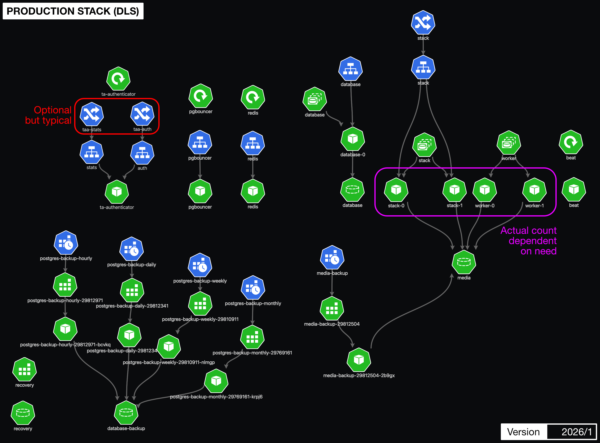

#################
KubeView Diagrams
#################

Various kubernetes topology diagrams, based on Namespace, created using KubeView.
To simplify the diagrams **Secrets** and **ConfigMaps** are not typically included.

***************************
Production Stack (DLS/Iris)
***************************

.. epigraph::

    The Fragalysis Stack on DLS/Iris has yet to be deployed this diagram is the
    *anticipated* topology where the existing database and media replication
    components are absent, but it includes an embedded TA authenticator.

