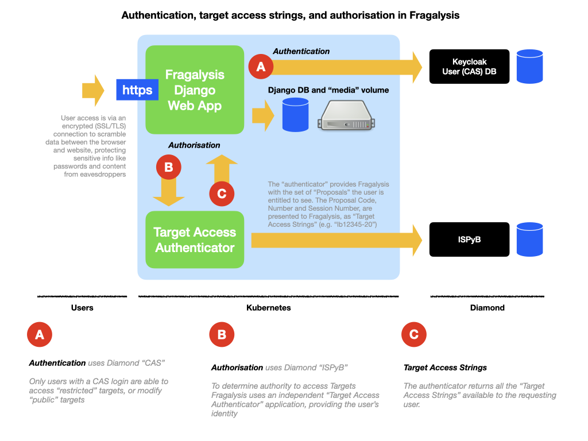

######################
Security in Fragalysis
######################

Fragalysis is a django application where data is stored in a PostgreSQL database
with larger, often binary files, stored on a persistent volume that Django
refers to as the *Media* directory.

User access to data (**Targets**) is controlled by serval processes that relate to
*authentication* (knowing who a user is) and *authorisation*
(knowing what they can access).

The following diagram sets the scene, and is described in more detail in the
following sections.

SSL/TLS
=======
Access to the Fragalysis stack web application passes through HTTPS, which prevents
malicious network users from *sniffing* authentication credentials or any other
information transferred between the client and server.

So, unless a user shares any data they obtain, *bad actors* cannot intercept the data.

Authentication (who are you?)
=============================
Django comes with a user *authentication* system. Although it also provides
*authorisation* mechanisms. Because of the complexity of authorising what user can *see*
in Fragalysis this process is deferred to a separate, independent authorisation
application (discussed below).

Fragalysis uses the Django **User** model but authentication (knowing who a user is)
is actually handled by an off-cluster Identity and Access Management service -
a Diamond-managed `Keycloak`_ instance in our case. Keycloak is the source of all users,
and their identities.

Users can use Fragalysis without logging in. Under these conditions Fragalysis
only permits these users to access **Targets** that have been *marked* as *Public*.
These public Targets cannot be modified by these users.

When Users login Fragalysis extends permissions to allow users to modify public Targets
and also see any Target data they are authorised to see.

Making targets Public
---------------------
Fragalysis stores Targets against a **Project** (see below), which has an
``open_to_public`` record field. An administrator sets this field manually,
as they have access to the Fragalysis database. **Targets** cannot be made
public by users.

Authorisation (what can you do?)
================================
Integrated into the built-in django filtering logic - the logic that determines what
objects (**Targets** and related items) the user can see - is a query to the remote
Diamond-managed ISPyB database.

Fragalysis records **Targets** (**Target Experiments**) against ISPyB *Proposals* and
*Visits* held in ISPyB, and saves these in its own **Project** database record.
As other Fragalysis objects also relate to Targets, and their Project records,
Fragalysis is able to identify the Proposal and Visit that any object belongs to.

To obtain a user's proposals and visits the filter uses a co-located service referred
to as the *Target Access Authenticator*. This service takes a user *identity* and
returns a set of **Target Access Strings (TAS)** for that user.

A **TAS** is essentially a *summary* reference to a record in the Diamond-managed
ISPyB database, and consists of a concatenation of each record's *Proposal Code*,
*Proposal Number*, and *Session Number* - typically something like ``lb12345-20``.

For performance reasons the *Target Access Authenticator* caches ISPyB query results
for each user for a few minutes. It does this to avoid excessive repeated, and expensive
ISPyB login sessions and queries. This is important because filtering queries made by
Fragalysis are frequent and over a period of days or weeks might easily reach
hundreds of thousands of queries.

.. note::
    The design of the *Target Access Authenticator* can be found in the resource-code
    repository where it is maintained, in `fragalysis-ispyb-target-access-authenticator`_.

Access to Kubernetes
====================
Fragalysis is located in a Kubernetes cluster, where its database and *Media* directory
are also located. Users cannot access the database or media directory directly - neither
presents a *public* surface - i.e. cannot be accessed from outside the cluster.

Fragalysis is managed by a team of administrators, who do have access to the cluster.

The team is kept small but as they have access to the cluster they are able to
access the django database and the media directory - primarily for debug and maintenance
duties. Consequently, as the data is not encrypted *at rest*, administrators ae able
to see all Fragalysis data.

.. _ispyb: https://ispyb.github.io/ISPyB
.. _keycloak: https://www.keycloak.org
.. _fragalysis-ispyb-target-access-authenticator: https://github.com/xchem/fragalysis-ispyb-target-access-authenticator
